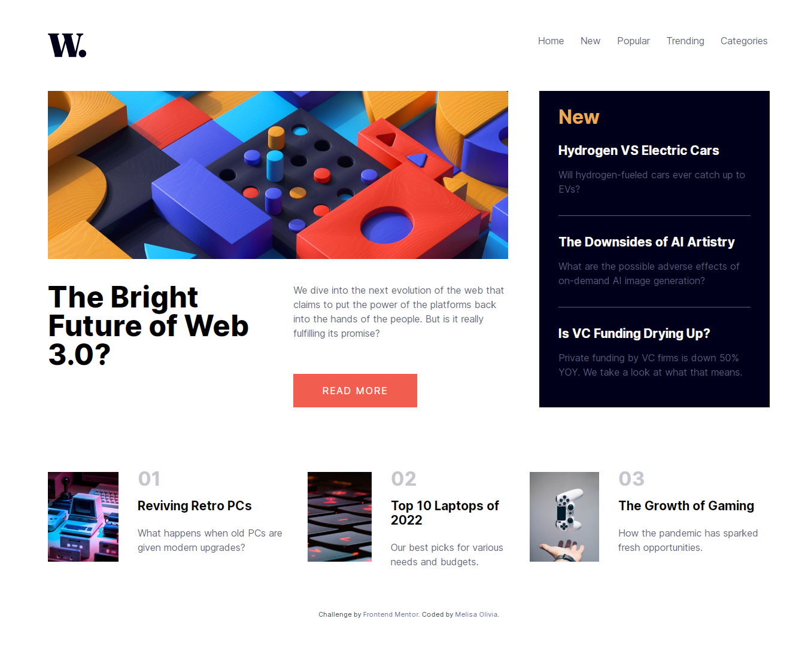
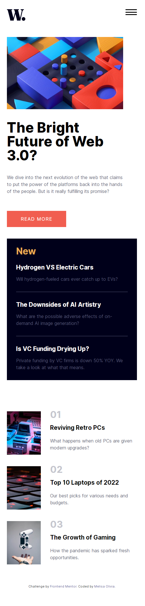

# Frontend Mentor Challenge - News homepage

## Welcome! 👋

Thanks for checking out my front-end coding challenge.

[Frontend Mentor](https://www.frontendmentor.io) challenges help you improve your coding skills by building realistic projects.

## The challenge

Users should be able to:
- View the optimal layout for the interface depending on their device's screen size
- See hover and focus states for all interactive elements on the page

## Links

- Live Site URL: [News Homepage](https://news-homepage-five-blond.vercel.app/)
- My Github Profile : [Melisa Olivia](https://github.com/melisaolivia)

## My process 
It's a fun process to solve this challenge! I learn a lot of TailwindCSS framework from there. At first, I'm planning to use vanilla CSS. But if I use the framework, it'll make the code more cleaner and the website will load faster. I'm learning breakpoints on tailwindCSS to in this project! FrontEndMentor really help me to sharping my frontend skill as beginner. I'm looking forward to solve more challenge in the future!

## Screenshot result

### Built with

- Semantic HTML5 markup
- Flexbox
- CSS Grid
- Mobile-first workflow
- [TailwindCSS](https://tailwindcss.com/)

**Thank You!** 🚀
